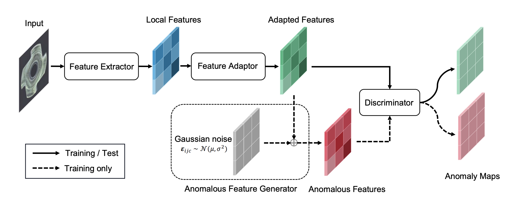

# SimpleNet




**SimpleNet: 一个简单的图像异常检测与定位网络**


[文献链接](https://openaccess.thecvf.com/content/CVPR2023/papers/Liu_SimpleNet_A_Simple_Network_for_Image_Anomaly_Detection_and_Localization_CVPR_2023_paper.pdf)


### 环境配置 

**Python3.8**

**Packages**:
- cuda==11.3
- torch==1.12.1
- torchvision==0.13.1
- numpy==1.22.4
- opencv-python==4.5.1


### 数据集


#### MvTecAD

可以从 [此链接](https://www.mvtec.com/company/research/datasets/mvtec-ad/) 查看并下载数据集。


### 运行

#### 模型训练

'run.sh'提供了在MVTecAD数据集上训练模型的配置。
```
bash run.sh
```
